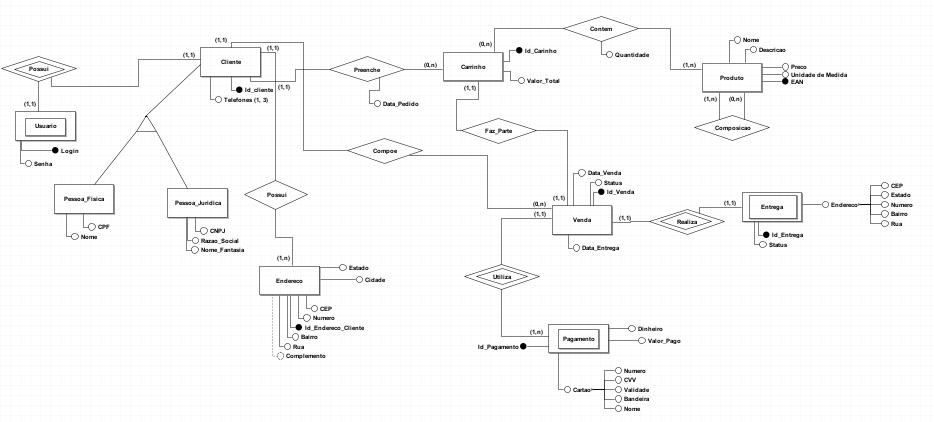

# Banco de Dados FastFeira

Elaboração do minimundo e MER

## Como contribuir
    
    Verificar na caixa de e-mail vinculada ao GitHub e aceitar o convite para ser um colaborador.
   
  
    1 - Fazer um clone ( https://github.com/jjunio01/banco-de-dados.git) do repositorio em sua maquina local;
    2 - Executar o Arquivo 'brModelo' e abrir com diagrama FastFeira.brM3;
    3 - Realizar as modificações necessárias ( Antes das alterações realizar o git pull);
    4 - Salvar as alterações;
    5 - Efetuar o git add .;
    6 - git commit -m"COMENTARIO SOBRE AS ALTERAÇÕES REALIZADAS"
    7 - git push origin master
    
    
## Minimundo
- [Minimundo](https://docs.google.com/document/d/1EXb_r57xTZIlhXlHEyooMcfqOUfG32Vvms5OPIVSF2Y/edit)

 #### Modelo Entidade Relacionamento - MER
  

## Colaboradores:
  - [@Edreyl16](https://github.com/Edreyl16) Edrey Lucas dos Anjos Augusto
  - [@jjunio01](https://github.com/jjunio01) Jose Junio Araujo da Silva  
  - [@mikaelbr073](https://github.com/Mikaelbr073) Mikael Carvalho de Barros
  - [@PettersonDouglas](https://github.com/PettersonDouglas) Petterson Douglas Ataíde Silva
